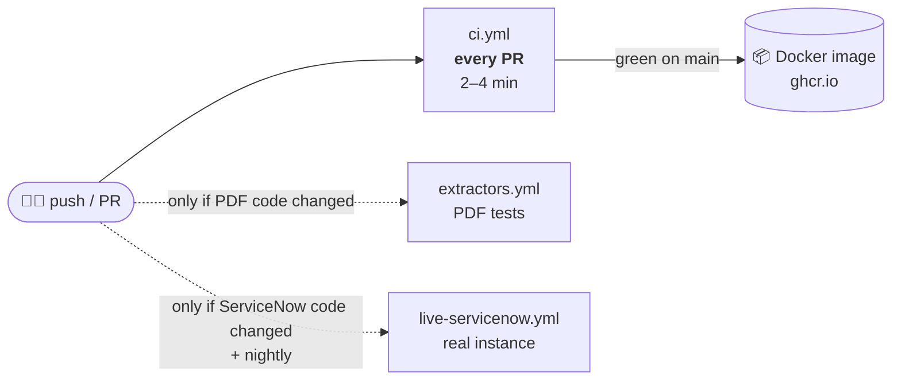
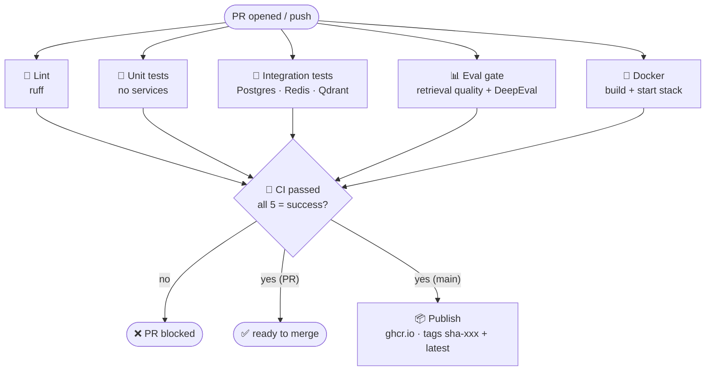
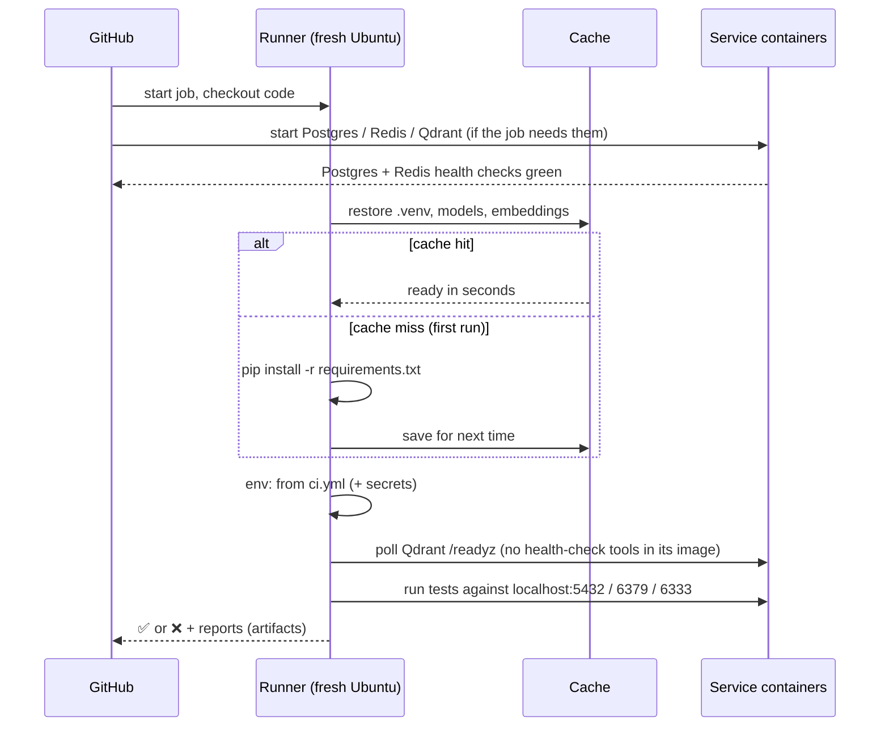
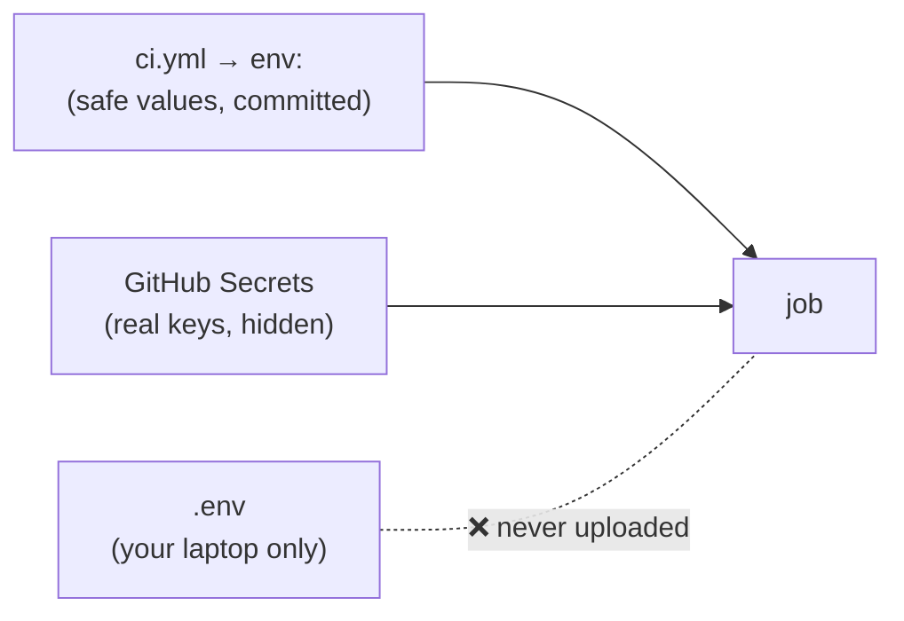
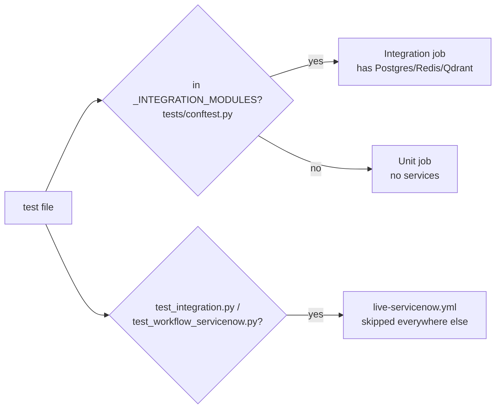
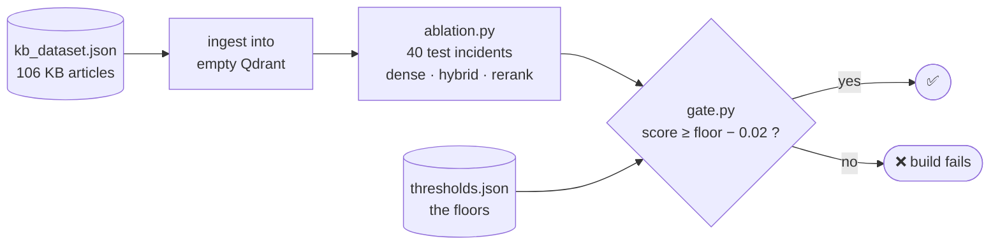
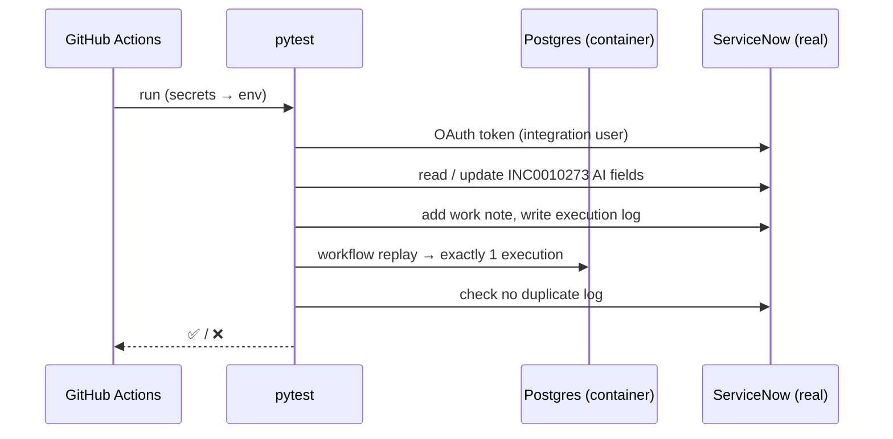

# CI/CD Pipeline

> Every push is checked automatically on a clean machine. If everything passes on `main`, a ready-to-run Docker image is published.
> PRD: **D-09**, **NFR-10**, **FR-20** (retrieval part).
> Sprint 4 deliverable (triggers, services, Docker, merge-blocking evidence, runtime): [`sprint4_cicd_pipeline.md`](sprint4_cicd_pipeline.md).

---

## 1. What is CI/CD?

| | In one sentence |
|---|---|
| **CI** (Continuous Integration) | GitHub runs lint + tests + quality checks on **every PR**. Red ❌ = don't merge. |
| **CD** (Continuous Delivery) | When `main` is green, GitHub **builds and publishes the Docker image**. That image is what you deploy. |

**Why?** A bug shows up in the PR, not in the demo.

---

## 2. The big picture: 3 workflows



| Workflow | When it runs | What it proves |
|---|---|---|
| `ci.yml` | Every PR, push to `main` / `development` | Code is clean, tests pass, quality didn't drop, image builds |
| `extractors.yml` | PDF extractor code or the manual changed, push to `main` | Table / layout / OCR extraction still works (slow: ~3 min) |
| `live-servicenow.yml` | ServiceNow code changed, push to `main`, every night, or by hand | The **real** ServiceNow instance still matches our code |

---

## 3. `ci.yml`: the main pipeline

All 5 checks start **at the same time**. Total time = the slowest job. Then the **`CI passed`** gate collects their results.



| Job | Checks | Command |
|---|---|---|
| Lint | Syntax errors, undefined names | `ruff check .` |
| Unit | ~415 tests, no services needed | `pytest -m "not integration" -n auto` |
| Integration | ~150 tests on real Postgres, Redis, Qdrant | wait for Qdrant → `alembic upgrade head` → `pytest -m integration` |
| Eval gate | Search quality didn't get worse | wait for Qdrant → `ingest local` → `ablation.py` → `gate.py` → DeepEval (if present) |
| Docker | Image builds, API starts | `docker build` → `compose up` → `curl /health /ready` |
| **CI passed** | Every job above ended in `success` (failed, cancelled **or skipped** = ❌) | `jq` over `needs` |
| Publish | *main only, after all green* | push image to GHCR |

**`CI passed` is the only check branch protection requires.** New job? Add it to the gate's `needs:` in `ci.yml`; the protection rules stay the same.

**Cancelling:** a new push to the same PR cancels the older run. Pushes to `main` / `development` are never cancelled, so every merge gets a full run (and publish).

---

## 4. Code flow: what happens inside a job



**Where settings come from**



---

## 5. How tests are split



> ✏️ **New test needs a database?** Add its file name to `_INTEGRATION_MODULES` in `tests/conftest.py`.

---

## 6. The eval gate



- **Fixed data:** the KB is a committed snapshot, so a score change always means a **code** change.
- **Fast:** embeddings are cached between runs (~35 s instead of ~6 min).
- **Tested:** a real regression (smaller candidate pool) dropped hit@5 0.406 → 0.375 and the gate failed ✔.

Current floors: dense hit@5 **0.406** · hybrid **0.375** · hybrid_rerank **0.406** (plus MRR and recall, see `eval/thresholds.json`).

| You… | Then… |
|---|---|
| Improved retrieval | Raise the floors in `thresholds.json` in the same PR |
| Changed the KB in ServiceNow | `python -m scripts.export_kb_snapshot` → commit → update floors |
| Want LLM-judge scores (faithfulness…) | Write them into the results JSON + add floors. `gate.py` needs no change |
| Add the DeepEval regression suite | Put it at `eval/deepeval_regression.py`, exit non-zero on failure, pin `deepeval` in `requirements.txt` |

**DeepEval step:** runs after `gate.py`, only if `eval/deepeval_regression.py` exists (until then it logs a notice and passes). It installs `deepeval`, runs the file with the `LITELLM_*` secrets, and a non-zero exit fails the eval gate → `CI passed` → merge blocked.

⚠️ Known: hybrid doesn't beat dense yet (NFR-08), and KB0013–KB0026 aren't published in ServiceNow.

---

## 7. Live ServiceNow tests



- **Test incident:** `INC0010273` (`sys_id b9943662c36f8710b9523342b40131ee`). It's dedicated to CI, has `ai_enabled = false` so the agent never processes it, and **must not be closed**.
- **One run at a time:** runs queue, so two runs never write to the same incident together.
- **Not on every PR:** it writes to a real system, and the instance can be asleep. A failure here usually means *the instance changed*, not the code.

---

## 8. One-time GitHub setup

**Settings → Secrets and variables → Actions → New repository secret**

| Secret | Value from | Used by |
|---|---|---|
| `CI_POSTGRES_USER` | any name that appears nowhere else, e.g. `barq_ci` (secrets are masked in logs, so `app` would hide every "app") | ci.yml, live-servicenow.yml (throwaway Postgres container) |
| `CI_POSTGRES_PASSWORD` | random, e.g. `python -c "import secrets; print(secrets.token_urlsafe(24))"` | ci.yml, live-servicenow.yml |
| `LITELLM_BASE_URL` | `.env` | ci.yml (integration, eval) |
| `LITELLM_API_KEY` | `.env` | ci.yml (integration, eval) |
| `LITELLM_EMBEDDING_MODEL` | `.env` | ci.yml (integration, eval) |
| `SERVICENOW_INSTANCE_URL` | `.env` | live-servicenow.yml |
| `SERVICENOW_OAUTH_CLIENT_ID` | `.env` | live-servicenow.yml |
| `SERVICENOW_OAUTH_CLIENT_SECRET` | `.env` | live-servicenow.yml |
| `SERVICENOW_OAUTH_USERNAME` | `.env` | live-servicenow.yml |
| `SERVICENOW_OAUTH_PASSWORD` | `.env` | live-servicenow.yml |
| `INCIDENT_SYS_ID` | `b9943662c36f8710b9523342b40131ee` | live-servicenow.yml |
| `INCIDENT_NUMBER` | `INC0010273` | live-servicenow.yml |

Then:
1. **Settings → Branches →** protect `main` **and** `development`: *Require a pull request*, *Require status checks* → **`CI passed`** (appears after its first run), *Require branches to be up to date*.
2. **Settings → Actions → General:** allow actions from GitHub + `docker/*` + `astral-sh/*`.
3. After the first publish: **Packages** → make the image public if needed.

🔒 Never commit `.env`. Never put a real value (no password, not even a throwaway one) in `ci.yml`.

---

## 9. Speed tricks (why it's 2–4 min)

| Trick | Saves |
|---|---|
| Jobs in parallel | wall time = slowest job |
| Cached `.venv` | ~2 min pip install |
| Cached embeddings | ~5 min API calls |
| Docker layer cache | full rebuilds |
| `pytest -n auto` | uses all cores |
| Slow PDF + live tests in their own workflows | ~3 min on most PRs |

First run on a new branch fills the caches, so it takes ~6–8 min. After that: 2–4 min.

---

## 10. Run it locally

```bash
ruff check .                                    # Lint
pytest -m "not integration" -n auto \
  --ignore=tests/test_extractors_layout.py \
  --ignore=tests/test_extractors_tables.py \
  --ignore=tests/test_ingest_stressors.py       # Unit
alembic upgrade head && pytest -m integration   # Integration (needs docker compose up)
python -m src.retrieval.ingest local            # Eval gate (empty Qdrant)
python eval/ablation.py --k 5 && python eval/gate.py
git restore eval/results/                       # ablation overwrites the Sprint 2 report files
```

---

## 11. Files

| File | What it is |
|---|---|
| `.github/workflows/ci.yml` | Main pipeline + CI settings (`env:`) |
| `.github/workflows/extractors.yml` | PDF extractor tests |
| `.github/workflows/live-servicenow.yml` | Real-instance tests |
| `.github/actions/setup/action.yml` | Shared setup: Python 3.12 + caches |
| `pyproject.toml` | ruff + pytest settings |
| `tests/conftest.py` | `_INTEGRATION_MODULES` list |
| `data/kb_dataset.json` | KB snapshot for the eval gate |
| `scripts/export_kb_snapshot.py` | Refresh that snapshot |
| `eval/gate.py` · `eval/thresholds.json` | The gate and its floors |
| `eval/deepeval_regression.py` | DeepEval regression suite (not added yet; CI runs it once it exists) |
| `docs/sprint4_cicd_pipeline.md` | Sprint 4 deliverable: evidence + runtime profile |
