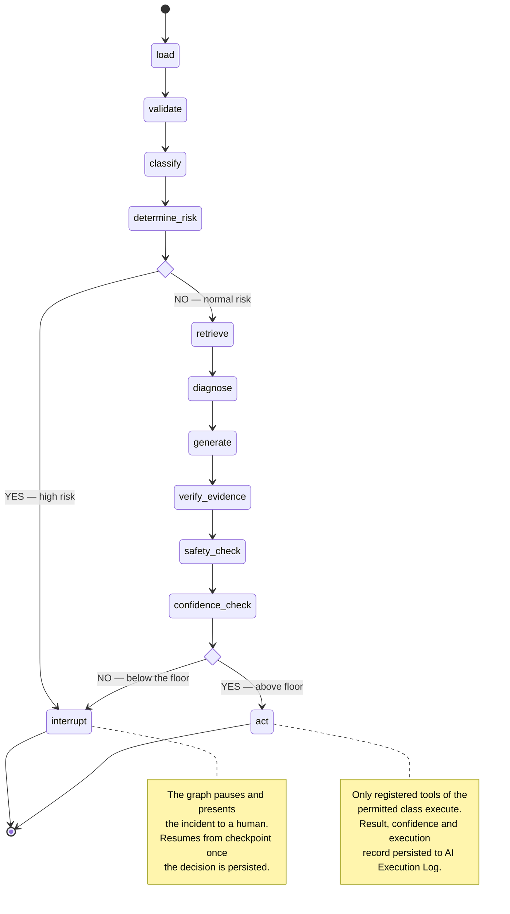

# Graph State Diagram

```mermaid
stateDiagram-v2
    [*] --> load
    load --> validate
    validate --> classify
    classify --> determine_risk

    state high_risk_check <<choice>>
    determine_risk --> high_risk_check

    high_risk_check --> interrupt : YES — high risk
    high_risk_check --> retrieve : NO — normal risk

    retrieve --> diagnose
    diagnose --> generate
    generate --> verify_evidence
    verify_evidence --> safety_check
    safety_check --> confidence_check

    state confidence_check_decision <<choice>>
    confidence_check --> confidence_check_decision

    confidence_check_decision --> interrupt : NO — below the floor
    confidence_check_decision --> act : YES — above floor

    interrupt --> [*]
    act --> [*]

    note right of interrupt
        The graph pauses and presents
        the incident to a human.
        Resumes from checkpoint once
        the decision is persisted.
    end note

    note right of act
        Only registered tools of the
        permitted class execute.
        Result, confidence and execution
        record persisted to AI Execution Log.
    end note
```

