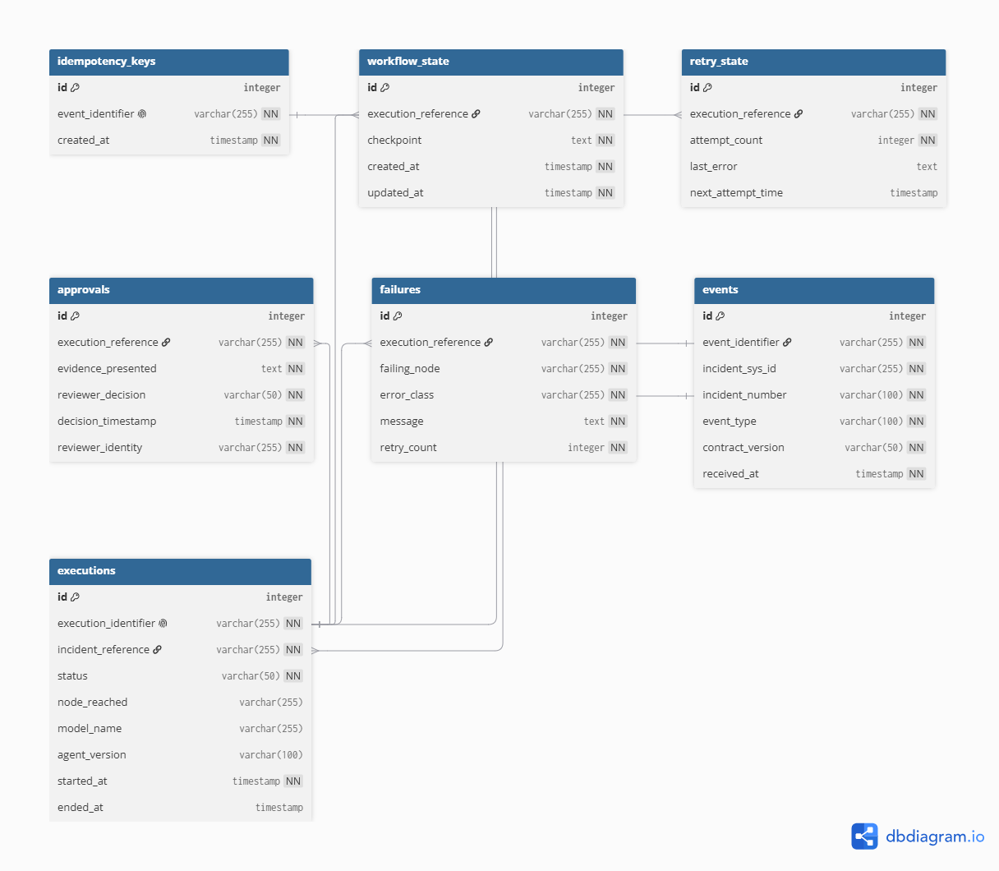

# Sprint 2 — PostgreSQL State Schema, Migrations & Idempotency

## 1. Scope

Sprint 2 implements the PostgreSQL state layer for the Agentic Incident
Resolution Platform.

PostgreSQL is the system of record for platform execution state, including:

- inbound events
- idempotency keys
- executions
- workflow checkpoints
- approvals
- failures
- retry state

The vector store is used for knowledge retrieval and is not used as the
authoritative store for workflow or execution state.

---

## 2. PostgreSQL State Schema

The Sprint 2 schema contains seven application state tables:

| Table | Purpose |
|---|---|
| `events` | Stores inbound incident events |
| `idempotency_keys` | Prevents duplicate event processing |
| `executions` | Stores workflow execution state |
| `workflow_state` | Stores serialized workflow checkpoints |
| `approvals` | Stores human approval decisions |
| `failures` | Stores workflow failure information |
| `retry_state` | Stores retry scheduling information |

An Alembic migration creates the schema:

`416136e54c32_create_sprint2_state_schema.py`

The migration supports both forward and reverse execution.

---

## 3. Entity Relationship Diagram



The diagram represents logical application-level relationships between
the state tables.

Execution-related reference columns are implemented as SQL `FOREIGN KEY`
constraints in the migration:

- `workflow_state.execution_reference` → `executions.execution_identifier`
- `approvals.execution_reference` → `executions.execution_identifier`
- `failures.execution_reference` → `executions.execution_identifier`
- `retry_state.execution_reference` → `executions.execution_identifier`

This prevents child state records from referencing an execution that does
not exist and protects the integrity of the audit trail.

---

## 4. Events

The `events` table represents an inbound event received by the platform.

Important fields include:

- `event_identifier`
- `incident_sys_id`
- `incident_number`
- `event_type`
- `contract_version`
- `received_at`

`event_identifier` identifies the inbound event and is used together with
the idempotency table to prevent duplicate processing.

`incident_sys_id` is indexed to support incident-based queries.

---

## 5. Idempotency Enforcement

The `idempotency_keys` table contains one record for each accepted event
identifier.

The `event_identifier` column has a database-level unique constraint.

The application does not perform:

1. SELECT to check whether the event exists
2. INSERT if it does not exist

Instead, it attempts the INSERT directly and allows PostgreSQL to arbitrate
concurrent access.

Implementation:

```python
idempotency_key = IdempotencyKey(
    event_identifier=event_identifier
)

db.add(idempotency_key)

try:
    db.commit()
    return True

except IntegrityError:
    db.rollback()
    return False
```

A successful insert means the event is being processed for the first time.

A unique-constraint `IntegrityError` means another worker already accepted
the same event.

The failed transaction is rolled back and the event is reported as a
duplicate.

---

## 6. Concurrency Verification

`tests/test_idempotency.py` contains a concurrent replay test.

Two worker threads use independent database sessions and synchronize on a
barrier before attempting to insert the same event identifier.

The test verifies:

```text
Worker A → accepted
Worker B → rejected
Database → exactly one idempotency key
```

The concurrency assertions verify that:

```python
assert errors == []
assert sum(result["status"] == "started" for result in results) == 1
assert sum(result["status"] == "duplicate" for result in results) == 1
```

The database is also checked to contain exactly one accepted event,
one idempotency key, and one execution.

This verifies duplicate suppression under concurrent worker access.

---

## 7. Execution State

Each accepted event creates an `Execution`.

An execution contains:

- `execution_identifier`
- `incident_reference`
- `status`
- `node_reached`
- `model_name`
- `agent_version`
- `started_at`
- `ended_at`

The `execution_identifier` is a unique identifier for the workflow
execution.

It is also the reference used by workflow checkpoints, approvals,
failures, and retry state.

The database enforces these relationships with foreign keys.


Execution status is constrained at the database level to:

```text
started
succeeded
failed
blocked
abandoned
```

The database also enforces:

```text
ended_at IS NULL OR ended_at >= started_at
```

These constraints prevent invalid execution states from being persisted.

---

## 8. Workflow State

`workflow_state` stores serialized workflow checkpoints.

Each checkpoint is associated with an execution using:

```text
workflow_state.execution_reference
    →
executions.execution_identifier
```

The `node_name` is stored separately from the serialized checkpoint so
audit queries can identify the node without parsing the JSON payload.

Checkpoints can be ordered using `created_at` and `id`.

---

## 9. Approvals

The `approvals` table records human governance decisions.

It stores:

- execution reference
- evidence presented
- reviewer decision
- decision timestamp
- reviewer identity

Approval records are immutable after creation.

The PostgreSQL migration installs a trigger that rejects both UPDATE and
DELETE operations on approval records. The approval tests verify that
attempting to overwrite or delete an existing approval is rejected.

---

## 10. Failures

The `failures` table records execution failures.

It stores:

- execution reference
- failing node
- error class
- error message
- retry count

Failures provide historical evidence of why an execution failed.

---

## 11. Retry State

The `retry_state` table stores retry information for an execution.

It contains:

- execution reference
- attempt count
- last error
- next attempt time

The execution identifier remains the stable reference across retry
attempts for the same workflow execution.

---

## 12. Audit Query Layer

The platform provides an application-level audit query layer in:

```text
src/db/audit_service.py
```

The main function is:

```python
get_execution_audit(db, execution_identifier)
```

It reconstructs the audit trail for one execution by querying the
execution, workflow checkpoints, failures, and approvals.

The returned structure includes:

- execution status and timing
- termination reason
- workflow nodes in execution order
- checkpoint/evidence data
- failure information
- approval decisions and evidence

The audit layer is covered by:

```text
tests/test_audit_service.py
```

The SQL examples below remain useful as low-level diagnostic queries, but
they are not the application's primary audit interface.

### Low-Level Diagnostic Queries

A basic execution query is:

```sql
SELECT
    execution_identifier,
    incident_reference,
    status,
    node_reached,
    model_name,
    agent_version,
    started_at,
    ended_at
FROM executions
WHERE execution_identifier = '<EXECUTION_ID>';
```

Workflow checkpoints can be queried using:

```sql
SELECT
    execution_reference,
    checkpoint,
    created_at,
    updated_at
FROM workflow_state
WHERE execution_reference = '<EXECUTION_ID>'
ORDER BY created_at;
```

Failures can be queried using:

```sql
SELECT
    execution_reference,
    failing_node,
    error_class,
    message,
    retry_count
FROM failures
WHERE execution_reference = '<EXECUTION_ID>';
```

Approval evidence can be queried using:

```sql
SELECT
    execution_reference,
    evidence_presented,
    reviewer_decision,
    decision_timestamp,
    reviewer_identity
FROM approvals
WHERE execution_reference = '<EXECUTION_ID>'
ORDER BY decision_timestamp;
```

Retry information can be queried using:

```sql
SELECT
    execution_reference,
    attempt_count,
    last_error,
    next_attempt_time
FROM retry_state
WHERE execution_reference = '<EXECUTION_ID>';
```

Together with `src/db/audit_service.py`, these queries provide execution
nodes, sequence information, timing, evidence, decisions, retry information,
and failure information.

---

## 13. Replay Protection

The workflow performs idempotency enforcement before creating an execution.

The execution flow is:

```text
Inbound Event
     |
     v
Idempotency INSERT
     |
     +---- duplicate ----> Stop
     |
     v
Create Execution
     |
     v
Workflow Processing
```

Therefore, a replayed event does not create a second execution.

The workflow test verifies that replaying the same event results in:

```text
First event  → started
Second event → duplicate
Executions   → exactly 1
```

The ServiceNow integration test additionally verifies the replay behavior
against the ServiceNow execution-log integration.

The end-to-end replay verification confirms that an accepted event creates
one execution and that replaying the same event does not create a secondary
execution or a second ServiceNow execution-log entry.

---

## 14. State and Retrieval Separation

PostgreSQL and the vector store have different responsibilities.

PostgreSQL is responsible for authoritative platform state:

- event processing
- execution state
- workflow checkpoints
- approvals
- failures
- retries
- idempotency

The vector store is responsible for knowledge retrieval.

This separation prevents workflow state from depending on semantic-search
storage and allows execution state to be queried deterministically using
relational queries.

---

## 15. Qdrant State Inspection

The Sprint 2 requirement calls for inspection of Qdrant payloads to verify
that application execution state is not stored in the vector store.

A read-only payload inspection was performed in the available team
environment against the `barq_knowledge_base` collection. The inspection
confirmed that the collection is used for knowledge/retrieval payloads and
did not contain the PostgreSQL workflow/application-state entities.

The expected separation is:

```text
PostgreSQL
  events
  idempotency_keys
  executions
  workflow_state
  approvals
  failures
  retry_state

Qdrant
  knowledge/retrieval documents
  embeddings
  retrieval metadata
```

The repository's earlier S1.4 verification also records that the
`barq_knowledge_base` collection contained 86 retrieval points and that the
collection persisted across Qdrant restart/down-up cycles.

Important limitation: the local development machine used for the Sprint 2
work does not have the Qdrant service running, so the live payload inspection
was performed in the available team environment rather than locally. No
application-state fields were added to Qdrant by Sprint 2.

This supports FR-15's state/retrieval separation: PostgreSQL remains the
authoritative source for workflow and execution state, while Qdrant remains
a retrieval system.

## 16. Data Retention

Sprint 2 defines the following retention policy for PostgreSQL execution
and audit state.

| Data | Retention Period | Post-Retention Action |
|---|---:|---|
| `executions` | 1 year | Archive or delete |
| `workflow_state` | 1 year | Archive or delete |
| `approvals` | 1 year | Archive or delete |
| `failures` | 1 year | Archive or delete |
| `retry_state` | 90 days after the execution becomes terminal | Delete |

### Retention Rules

Execution records and their associated workflow, approval, and failure
records are retained for one year to support incident investigation,
execution reconstruction, and audit requirements.

Retry state is operational state rather than long-term audit evidence.
It is retained for 90 days after the associated execution reaches a
terminal state:

- `succeeded`
- `failed`
- `blocked`
- `abandoned`

### Deletion and Archival

Sprint 2 defines the retention policy but does not run automatic deletion
or archival inside the application workflow.

Production retention automation must:

1. identify records whose retention period has expired;
2. preserve required audit evidence before deletion;
3. delete dependent records before their referenced execution records;
4. record the retention/archival operation in an appropriate operational
   audit log;
5. avoid deleting records subject to an active investigation, legal hold,
   or other compliance requirement.

No automatic retention job is included in Sprint 2.

---

## 17. Migration Verification

Migration verification was performed against a dedicated empty PostgreSQL
database so the migration path was tested from a clean starting state.

The forward migration was run with:

```powershell
py -m alembic upgrade head
```

After the upgrade, the database contained:

```text
alembic_version
approvals
events
executions
failures
idempotency_keys
retry_state
workflow_state
```

The reverse migration was then run with:

```powershell
py -m alembic downgrade base
```

After the downgrade, the application tables were removed and only the
Alembic metadata table remained:

```text
alembic_version
```

The schema was then rebuilt with:

```powershell
py -m alembic upgrade head
```

Finally:

```powershell
py -m alembic check
```

reported:

```text
No new upgrade operations detected.
```

The migration verification output is also committed in:

```text
docs/sprint2_migration_verification.txt
```

The resulting PostgreSQL database contains:

## 18. Test Verification

The automated verification suite has been executed successfully.

The tests cover:

- first-event acceptance
- duplicate-event rejection
- concurrent duplicate suppression
- workflow execution creation
- workflow replay protection
- workflow failure recording
- ServiceNow replay behavior
- execution status validation
- execution timestamp ordering
- foreign-key enforcement
- audit reconstruction
- approval immutability
- retry state management

Database-level verification also confirms that:

```text
invalid execution status
    → rejected by ck_executions_status

ended_at < started_at
    → rejected by ck_executions_time_order

child row referencing a nonexistent execution
    → rejected by the corresponding foreign-key constraint
```

The full test suite was rerun after the schema and validation changes and
passed successfully.

---

## 19. Review Notes and Scope Clarification

The supplied Sprint 2 brief requires a concurrent replay test and an
end-to-end replay demonstration, but it does not explicitly require
implementing a new HTTP webhook/API boundary.

The current implementation therefore verifies replay through the existing
workflow/state-processing path and the existing ServiceNow integration.
No new webhook boundary was introduced solely for Sprint 2.

If the project later requires webhook-level testing, the webhook can be
treated as an integration boundary around the existing workflow rather than
moving idempotency enforcement out of PostgreSQL.


Current verification status:

```text
Full automated test suite: PASSED
```

The concurrent execution test directly asserts that exactly one execution
row exists after two workers race on the same event identifier.

The concurrent execution test directly asserts that exactly one execution
row exists after two workers race on the same event identifier.
