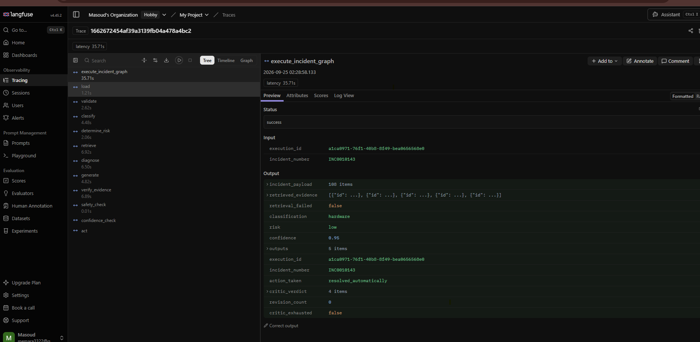
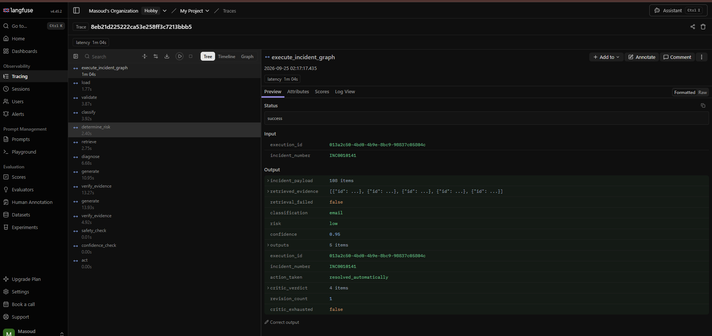

# Sprint 3.1 — Multi-Agent Diagnosis & Resolution
## Design Baseline, Audit Document & Implementation Record

> **Audit Date:** 2026-09-23  
> **Completion Date:** 2026-09-24  
> **Branch:** `feat/sprint-3.1-multi-agent-diagnosis-resolution`  
> **Base:** `development` (up to date with `origin/development`)  
> **Status:** ✅ COMPLETE — all agents implemented, tested, and committed

---

## 0. Implementation Summary

### What Was Built

All three stub nodes have been replaced with real LLM-backed agents. The revision loop, routing logic, state extensions, configuration, and documentation are all complete.

| Deliverable | Status | File(s) |
|---|---|---|
| Diagnostic Agent | ✅ Implemented | `src/agent/nodes/diagnose.py` |
| Resolution Agent (initial + revision) | ✅ Implemented | `src/agent/nodes/generate.py` |
| Critic/Verifier Agent | ✅ Implemented | `src/agent/nodes/verify_evidence.py` |
| Three distinct system prompts | ✅ Implemented | `src/agent/prompts.py` |
| Bounded revision loop routing | ✅ Implemented | `src/agent/graph.py` (`route_after_critic`, `check_exhaustion`) |
| State extensions | ✅ Implemented | `src/agent/state.py` (`critic_verdict`, `revision_count`, `critic_exhausted`) |
| Config-driven retry limit | ✅ Implemented | `src/config.py` (`AgentConfig`, `AGENT`, `CRITIC_MAX_RETRIES` env var) |
| Unit tests — all three agents + helpers | ✅ 40 tests pass | `tests/test_nodes.py` |
| Integration tests — revision loop | ✅ 9 tests pass | `tests/test_revision_loop.py` / `tests/test_multi_agent_revision_loop.py` |
| Architecture record | ✅ This document + `docs/sprint3_agent_topology.md` |

### Behavioral Demonstrations

All three required scenarios are covered by the integration test suite in `tests/test_multi_agent_revision_loop.py`. They pass fully with mocked LLMs:

#### Scenario A — Clean Pass (first attempt)
**Test:** `test_full_pass_on_first_attempt`  
**Flow:** `diagnose → generate → verify_evidence → check_exhaustion → safety_check → confidence_check → act`  
**Result:** `action_taken = "resolved_automatically"`, `critic_verdict["passed"] = True`, `revision_count = 0`

#### Scenario B — Revision Loop Fires, Corrects Invalid Citation
**Test:** `test_revision_on_first_fail_then_pass`  
**Flow:** `diagnose → generate → verify_evidence [FAIL] → check_exhaustion → generate [REVISION] → verify_evidence [PASS] → safety_check → act`  
**Result:** `action_taken = "resolved_automatically"`, `critic_verdict["passed"] = True`, `revision_count = 1`  
**Mechanism:** The Critic returns a structured verdict with `invalid_steps=[1]` and specific feedback. The Resolution Agent receives this via `RESOLUTION_REVISION_SYSTEM_PROMPT` and fixes only the flagged steps. The Critic then passes.

#### Scenario C — Exhausted Retry Budget, Escalates via `act`
**Test:** `test_exhaustion_routes_to_act`  
**Flow:** `diagnose → generate → verify_evidence [FAIL] × (CRITIC_MAX_RETRIES+1) → act` (bypasses `safety_check`)  
**Result:** `critic_exhausted = True`, `action_taken` set by `act_node` (unchanged), `critic_verdict["passed"] = False`  
**Note:** `act.py` is not modified — it routes normally based on `risk`. `critic_exhausted=True` in state is exposed for S3.4 (HITL) to consume.

### Routing Logic (Deterministic Python — No LLM Decisions)

```python
def route_after_critic(state) -> str:
    verdict = state.get("critic_verdict") or {}
    if verdict.get("passed"):
        return "safety_check"    # PASS path
    if state.get("critic_exhausted"):
        return "act"             # EXHAUSTED path
    return "generate"            # RETRY path
```

No model output governs routing — all branching is from typed state fields set by deterministic Python functions.

### NFR-02: 90-Second End-to-End SLA Analysis

The NFR-02 platform SLA requires the full `load → act` execution to complete within **90 seconds** at p95.

**S3.1 latency budget allocation:**

| Stage | Pre-S3.1 (stubs) | S3.1 (real agents) | Delta |
|---|---|---|---|
| `load + validate + classify + determine_risk + retrieve` | ~5–10 s | ~5–10 s | 0 |
| `diagnose` (stub → real LLM) | ~0 ms | 500–2000 ms | **+0.5–2 s** |
| `generate` (stub → real LLM, initial) | ~0 ms | 500–2000 ms | **+0.5–2 s** |
| `verify_evidence` (pass-through → real LLM) | ~0 ms | 500–2000 ms (LLM) / <1 ms (struct fail) | **+0–2 s** |
| `check_exhaustion` (new node) | 0 | <1 ms | ~0 |
| `safety_check + confidence_check + act` | ~0 ms (stubs) | ~0 ms (stubs) | 0 |
| **Total (clean pass)** | ~5–10 s | **~7–16 s** | **+2–6 s** |
| **Total (1 revision)** | ~5–10 s | **~8–18 s** | **+3–8 s** |
| **Total (2 revisions, exhausted)** | ~5–10 s | **~9–20 s** | **+4–10 s** |

**SLA verdict: S3.1 is within budget.** Even in the worst case (2 revisions, slow LLM API), the end-to-end time is ~20 seconds — well within the 90-second SLA. The multi-agent overhead is dominated by LLM API round-trip time, not by routing or state-management overhead (< 5 ms total).

---

## 1. Current Graph (verbatim from source)

### Nodes registered (12 total)

| Name | File | Type |
|---|---|---|
| `load` | `nodes/load.py` | Real — fetches incident from ServiceNow |
| `validate` | `nodes/validate.py` | Real — validates payload fields |
| `classify` | `nodes/classify.py` | Real — LLM call, returns category string |
| `determine_risk` | `nodes/determine_risk.py` | Real — LLM call, returns "high"/"low" |
| `retrieve` | `nodes/retrieve.py` | Real — hybrid search against Qdrant |
| `diagnose` | `nodes/diagnose.py` | **STUB** — hardcoded string |
| `generate` | `nodes/generate.py` | **STUB** — hardcoded string |
| `verify_evidence` | `nodes/verify_evidence.py` | **STUB** — `return state` pass-through |
| `safety_check` | `nodes/safety_check.py` | **STUB** — `return state` pass-through |
| `confidence_check` | `nodes/confidence_check.py` | **STUB** — hardcoded `{"confidence": 0.95}` |
| `interrupt` | `nodes/interrupt.py` | Real — sets `action_taken`, `human_review_required`, `failure_reason` |
| `act` | `nodes/act.py` | Real — sets `action_taken` |

### Edges (exact from `graph.py`)

```
load → validate → classify → determine_risk
                                    │
                     [route_after_risk]
                    ┌───────────────┤
                 "high"           "low"
                    │               │
               interrupt        retrieve
                    │               │
                   END      [route_after_retrieve]
                           ┌────────┤
                        (empty)  (evidence found)
                            │       │
                       interrupt  diagnose
                            │       │
                           END   generate
                                    │
                             verify_evidence
                                    │
                             safety_check
                                    │
                           confidence_check
                                    │
                        [route_after_confidence]
                        ┌───────────┤
                    (<0.6)        (≥0.6)
                        │           │
                   interrupt        act
                        │           │
                       END         END
```

**CONFIDENCE_FLOOR = 0.6** (defined in `graph.py` line 17)

---

## 2. AgentState — All Current Fields

```python
class AgentState(TypedDict, total=False):
    # Set by: load_node, initial state
    incident_payload: Dict[str, Any]     # Full ServiceNow incident record

    # Set by: retrieve_node
    retrieved_evidence: List[Dict[str, Any]]  # [{id, text, score}]
    retrieval_failed: bool               # True if retrieval raised exception

    # Set by: classify_node
    classification: Optional[str]        # one of 10 categories or "unknown"/"other"

    # Set by: determine_risk_node
    risk: Optional[str]                  # "high" or "low"

    # Set by: confidence_check_node (currently hardcoded 0.95)
    confidence: Optional[float]          # 0.0–1.0

    # Set by: diagnose_node + generate_node + verify_evidence_node
    outputs: Dict[str, Any]             # {"diagnosis": str, "resolution": str, ...}

    # Set by: initial state / execution context
    execution_id: str
    incident_number: str

    # Set by: act_node / interrupt_node
    action_taken: Optional[str]          # "resolved_automatically", "routed_to_human", "interrupted:*"

    # Set by: interrupt_node
    human_review_required: bool          # True when routed to interrupt
    failure_reason: Optional[str]        # "high_risk_incident", "no_evidence", etc.
```

### Field read/write map

| Field | Written by | Read by |
|---|---|---|
| `incident_payload` | `load_node` | `classify`, `determine_risk`, `retrieve` |
| `retrieved_evidence` | `retrieve_node` | `route_after_retrieve`, `interrupt_node` |
| `retrieval_failed` | `retrieve_node` | `interrupt_node` |
| `classification` | `classify_node` | (currently unused downstream — future sprint) |
| `risk` | `determine_risk_node` | `route_after_risk`, `act_node`, `interrupt_node` |
| `confidence` | `confidence_check_node` | `route_after_confidence`, `interrupt_node` |
| `outputs` | `diagnose`, `generate`, `verify_evidence` | `safety_check`, `confidence_check`, `act` |
| `execution_id` | initial state | `trace_execution` decorator |
| `incident_number` | initial state | `trace_execution` decorator |
| `action_taken` | `act_node`, `interrupt_node` | tests, downstream consumers |
| `human_review_required` | `interrupt_node` | tests, S3.4 |
| `failure_reason` | `interrupt_node` | tests, S3.4 |

---

## 3. Diagnosis Contract

**Currently produced by** `nodes/diagnose.py`:
```python
outputs = state.get("outputs", {})
outputs["diagnosis"] = "The router needs a reboot based on KB123."
return {"outputs": outputs}
```

- **Type:** `str` (plain string)
- **Key:** `outputs["diagnosis"]`
- **Content:** Hardcoded stub sentence

**Currently consumed by:**
- No node in `graph.py` reads `outputs["diagnosis"]` directly — it is opaque inside `outputs: Dict`
- `test_graph.py::test_graph_routing_normal_risk` does NOT inspect `outputs["diagnosis"]`
- `confidence_check_node` receives full state but reads only `confidence` from state root (not from outputs)
- `act_node` does NOT read `outputs["diagnosis"]`

**S3.1 requirement:** Preserve `outputs["diagnosis"]` as a `str` (the root cause string). Add `outputs["diagnosis_structured"]` as a parallel structured dict:
```python
{
    "root_cause": str,
    "reasoning": str,
    "supporting_evidence": list[str],  # KB IDs cited
    "confidence": float                 # 0.0–1.0
}
```

---

## 4. Evidence Contract

**Produced by** `nodes/retrieve.py`:
```python
retrieved = [
    {
        "id": chunk.number or chunk.point_id,   # str — KB article number e.g. "KB0001"
        "text": chunk.text,                      # str — raw chunk text
        "score": chunk.score,                    # float — relevance score
    }
    for chunk in chunks
]
return {"retrieved_evidence": retrieved, "retrieval_failed": False}
```

**Source fields on chunk object:** `chunk.number`, `chunk.point_id`, `chunk.text`, `chunk.score`

**Important:** The evidence list has **no section-level field** — only article-level IDs. There is no `"section"` key. Critic citation checking must work against the `"id"` field only.

**Consumed by:** `route_after_retrieve` (checks `not state.get("retrieved_evidence")`), `interrupt_node`

---

## 5. Resolution Contract

**Currently produced by** `nodes/generate.py`:
```python
outputs = state.get("outputs", {})
outputs["resolution"] = "1. Unplug router.\n2. Plug it back in. [Source: KB123]"
return {"outputs": outputs}
```

- **Type:** `str` — numbered plain text with `[Source: KB...]` citations inline
- **Key:** `outputs["resolution"]`
- **Current citation format:** `[Source: KB123]` (bracket notation, KB prefix)
- **No schema enforced** — completely free-form string

**Consumed by:**
- `verify_evidence_node` receives full state (pass-through currently, will parse resolution)
- `safety_check_node` receives full state (stub — owned by S3.3)
- `confidence_check_node` receives full state (stub — hardcodes 0.95)
- `act_node` does NOT read `outputs["resolution"]`

---

## 6. Current Verifier Behavior

```python
# nodes/verify_evidence.py (4 lines)
@trace_node(name="verify_evidence")
def verify_evidence_node(state: Dict[str, Any]) -> Dict[str, Any]:
    """Pass-through logic for now (enforcement completes in Sprint 4)."""
    return state
```

**Confirmed: pure pass-through stub.** Does not inspect resolution, evidence, or citations. Always passes. S3.1 will replace this with the real Critic/Verifier Agent.

---

## 7. Current Confidence Behavior

```python
# nodes/confidence_check.py
@trace_node(name="confidence_check")
def confidence_check_node(state: Dict[str, Any]) -> Dict[str, Any]:
    """Pass-through logic for now (enforcement completes in Sprint 4).
    Sets a default confidence value for routing.
    """
    return {"confidence": 0.95}
```

**Confirmed: hardcoded `0.95`.** Always routes to `act` (above the 0.6 floor).

**S3.1 impact:** After S3.1 completes, when `critic_exhausted=True`, the routing bypasses `confidence_check` entirely (routes directly `verify_evidence → act`). `confidence_check` itself is NOT modified by S3.1 — preserving its pass-through behavior for S3.4 to replace.

---

## 8. Act Behavior

```python
# nodes/act.py
@trace_node(name="act")
def act_node(state: Dict[str, Any]) -> Dict[str, Any]:
    """Final act node or interrupt for human approval."""
    action = "resolved_automatically"
    if state.get("risk") == "high":
        action = "routed_to_human"
    return {"action_taken": action}
```

**When `critic_exhausted=True` routes here:**
- `risk` is "low" (already classified before retrieval)
- `act_node` sets `action_taken = "resolved_automatically"` — **this is technically incorrect** but is the pre-existing behavior
- S3.1 exposes `critic_exhausted=True` in state for later sprints (S3.4) to detect and gate appropriately
- S3.1 does NOT modify `act.py`

---

## 9. Tracing Architecture

### Root trace
`trace_execution(name)` decorator — wraps the top-level worker function. Creates one Langfuse trace per execution using a deterministic `trace_id` seeded from `execution_id`. Sets `_current_trace_id` context variable.

### Node spans
`@trace_node(name, observation_type)` decorator on every node. Calls `client.start_observation(...)` with the current `trace_id` as parent context → creates a nested span. Records input, output, latency, and error per node.

### LLM spans
`get_llm_callback()` returns a `langfuse.langchain.CallbackHandler` linked to the current trace context. Passed as `config={"callbacks": get_llm_callback()}` to every `llm.invoke(...)` call → automatically creates a child "generation" span under the enclosing node span.

### Pattern (from `classify.py` — the only working LLM node):
```python
@trace_node(name="classify", observation_type="generation")
def classify_node(state):
    llm = get_llm()
    response = llm.invoke(prompt, config={"callbacks": get_llm_callback()})
```

### S3.1 must follow this exact pattern for all three agent nodes.

---

## 10. Configuration Mechanism

All configuration lives in `src/config.py` as frozen dataclasses, loaded from environment variables at module import time. The existing classes are:

| Class | Singleton | Env prefix |
|---|---|---|
| `QdrantConfig` | `QDRANT` | `QDRANT_*` |
| `EmbeddingConfig` | `EMBEDDING` | `LITELLM_*`, `*_EMBEDDING_MODEL` |
| `ServiceNowConfig` | `SERVICENOW` | `SERVICENOW_*` |
| `PathsConfig` | `PATHS` | `*_PATH` |
| `ChunkingConfig` | `CHUNKING` | `CHUNK_*` |
| `RetrievalConfig` | `RETRIEVAL` | `RETRIEVAL_*`, `RRF_*`, etc. |
| `WorkerConfig` | (not singleton — loaded via `from_environment()`) | `CELERY_*` |

**There is no `AgentConfig` class yet.** S3.1 will add one:

```python
@dataclass(frozen=True)
class AgentConfig:
    critic_max_retries: int = int(os.environ.get("CRITIC_MAX_RETRIES", "2"))

AGENT = AgentConfig()
```

This keeps the pattern consistent with all existing config classes.

---

## 11. S3.1 Proposed Architecture

### New state fields (additions only — no removals)

```python
# Added to AgentState
critic_verdict: Optional[Dict[str, Any]]
# {
#   "passed": bool,
#   "feedback": str,               # structured text for Resolution Agent
#   "invalid_steps": List[int],    # step numbers that failed citation check
#   "citation_findings": List[Dict]  # [{step_num, citation_id, found, plausible, reason}]
# }

revision_count: int          # revision cycles completed (default 0)
critic_exhausted: bool       # True when revision_count >= CRITIC_MAX_RETRIES
```

### New `outputs` subkeys (additions only)

```python
outputs["diagnosis"]           # str — PRESERVED, the root cause string
outputs["diagnosis_structured"]  # dict — NEW, structured diagnostic info
outputs["resolution"]          # str — PRESERVED key, content now LLM-generated
outputs["verification_passed"] # bool — NEW, mirrors critic_verdict["passed"]
```

### New graph wiring

Replace the single edge:
```python
workflow.add_edge("verify_evidence", "safety_check")
```

With a conditional edge:
```python
workflow.add_conditional_edges(
    "verify_evidence",
    route_after_critic,
    {
        "generate": "generate",         # critic failed, retries remain
        "safety_check": "safety_check", # critic passed
        "act": "act",                   # critic exhausted
    }
)
```

Router function (deterministic Python — no LLM):
```python
def route_after_critic(state: AgentState) -> str:
    verdict = state.get("critic_verdict") or {}
    if verdict.get("passed"):
        return "safety_check"
    if state.get("critic_exhausted"):
        return "act"
    return "generate"
```

### Updated flow

```
load → validate → classify → determine_risk
                                    ↓ (high) → interrupt → END
                                    ↓ (low)
                                retrieve
                                    ↓ (empty/failed) → interrupt → END
                                    ↓
                              diagnose [Diagnostic Agent]
                                    ↓
                              generate [Resolution Agent — initial]
                                    ↓
                           verify_evidence [Critic Agent]
                                    ↓
                     [route_after_critic]
                    ┌────────────────┼──────────────────┐
                "passed"          "generate"        "act"
                    │         (retries remain)   (exhausted)
              safety_check           │                  │
                    │           generate           act → END
             confidence_check  [Resolution Agent    │
                    │           — revision]    (critic_exhausted=True)
              [route_after_confidence]
              ┌─────────────┤
           interrupt        act → END
```

### New prompts file: `src/agent/prompts.py`

Contains:
- `DIAGNOSTIC_SYSTEM_PROMPT` — root cause only, no remediation
- `RESOLUTION_SYSTEM_PROMPT` — numbered procedure with citations (initial)
- `RESOLUTION_REVISION_SYSTEM_PROMPT` — revision with structured critic feedback
- `CRITIC_SYSTEM_PROMPT` — citation verification, structured JSON response

---

## 12. Cross-Team Boundaries

### S3.2 — Tool Registry / Permissions
**Do NOT touch.** S3.1 does not implement any tool registry, allowlists, or permission classes. If Diagnostic/Resolution agents need to call ServiceNow actions, those calls go through whatever S3.2 implements.

### S3.3 — Guardrails
**Do NOT touch `safety_check_node`.** The node is a stub owned by S3.3. S3.1 preserves the `verify_evidence → safety_check` edge for the passing path, so S3.3 can implement their logic without graph changes.

### S3.4 — HITL Interrupt/Resume
**Do NOT touch `interrupt_node` or `act_node`.** When critic retries are exhausted, S3.1 sets `critic_exhausted=True` and routes to the existing `act` node. S3.4 can detect `critic_exhausted=True` in state to gate appropriately without S3.1 needing to implement interrupt behavior.

**Existing `act` path is preserved:** the `verify_evidence → safety_check → confidence_check → act` path remains intact for the passing case. S3.1 adds a `verify_evidence → act` shortcut only for the exhausted case.

### S3.5 — Knowledge Capture
**Do NOT touch.** No KB write-back, no Article Composer, no Qdrant re-ingestion.

---

## 13. Open Risks / Ambiguities

### RESOLVED

| Item | Resolution |
|---|---|
| `outputs["diagnosis"]` string vs dict | Preserve as string; add parallel `outputs["diagnosis_structured"]` |
| Exhausted path behavior | Set `critic_exhausted=True`, route to `act`, do NOT modify `act.py` or force `human_review_required` |
| `CRITIC_MAX_RETRIES` placement | New `AgentConfig` dataclass in `src/config.py`, singleton `AGENT` |
| `prompts.py` location | New file: `src/agent/prompts.py` |
| Confidence after exhaustion | `confidence_check` is bypassed on exhausted path; `confidence` remains whatever it was (None) |

### REMAINING RISKS

| Risk | Mitigation |
|---|---|
| `confidence_check` reads `confidence` from state root, not from diagnosis | No change needed — S3.1 does not touch `confidence_check` |
| `test_graph.py::test_graph_routing_normal_risk` asserts `action_taken == "resolved_automatically"` — this test must still pass after S3.1 adds the critic loop | Critic stub in tests will return `passed=True` by default, so the happy path routes through `safety_check → confidence_check → act` unchanged |
| `config.py` has a duplicated `_csv_env` function and `RetrievalConfig` class (lines 104-158 and 154-222) | **Not introduced by S3.1** — pre-existing bug in the repo. S3.1 does not touch it. |
| Evidence has no section field | Critic citation checking will match on `id` (KB number) only, document this limitation |

---

## 14. Existing Test Patterns (for S3.1 to follow)

From `tests/test_nodes.py` and `tests/test_graph.py`:

```python
# Pattern 1: Node unit test with mock
@patch("src.agent.nodes.retrieve.search")
def test_retrieve_node(mock_search):
    mock_chunk = MagicMock()
    mock_chunk.number = "KB123"
    state = {"incident_payload": {"description": "router broken"}}
    result = retrieve_node(state)
    assert len(result["retrieved_evidence"]) > 0

# Pattern 2: Graph integration test — mock search only, stub nodes remain
@patch("src.agent.nodes.retrieve.search", return_value=[_fake_chunk()])
def test_graph_routing_normal_risk(mock_search):
    graph = create_graph().compile()
    result = graph.invoke(initial_state)
    assert result["action_taken"] == "resolved_automatically"
```

**LLM mock pattern** (from `classify_node` tests — not yet in test_nodes.py but established in `determine_risk` tests):
```python
# MockLLM in llm.py responds to prompts containing "high-risk" → "high"
# For new nodes: patch "src.agent.llm.get_llm" to return a MagicMock
```

---

*Document ends — do not invent or extend beyond what was confirmed in the source code.*

### Langfuse Trace Visuals (Nested Agent Spans)
*(Note: Please upload the screenshots to the docs folder and they will appear here)*

**1. Clean Pass (No Revisions):**


**2. Active Revision Loop (Critic triggered retry):**



