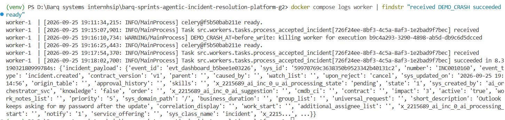
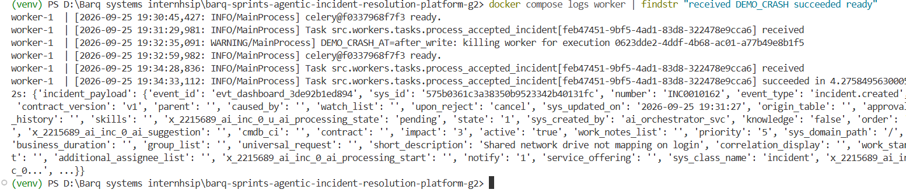
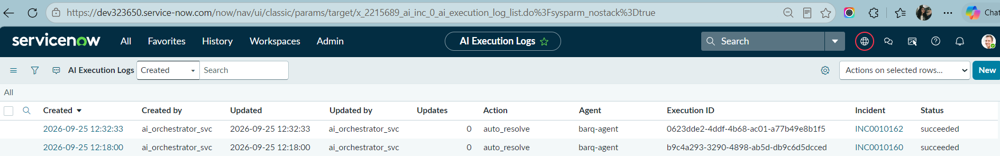

# Sprint 3 — S3.4 Crash Recovery: Checkpointed Retry & Exactly-Once ServiceNow Write

**Author:** Bassant Hossam , **Branch:** `s3.4-interrupt-resume`

## Summary

S2.5 wired a Postgres checkpointer, but a retried task still called `graph.invoke(initial_state)` and
started again from `load`. Redis also waited **1 hour** before giving a dead worker's task back. S3.4 closes
FR-12 / NFR-03:

- a retry or re-delivery **continues from the last completed node**
- the only ServiceNow side effect (`act`) is written **exactly once**, even when the worker dies between the
  write and the checkpoint
- Postgres audit rows tell a **human resume** apart from a **crash recovery**

Live results on the PDI (25 Sep 2026), the worker process really killed (`os._exit`, like `kill -9`):

| case | incident | killed at | ServiceNow after crash | after recovery | recovered in |
|---|---|---|---|---|---|
| before the write | INC0010154 | 17:37:52, right before the PATCH | 0 log rows | **1** row `auto_resolve` | 7 s (no LLM step re-run) |
| after the write | INC0010155 | 17:41:39, after the log row, before the checkpoint | 1 row (17:41:38) | **still 1** row, the same one | 4 s |
| before the write (repeat, screenshots) | INC0010160 | 19:16:10 | 0 log rows | **1** row, created 19:18:00 after recovery | 8.3 s |
| after the write (repeat, screenshots) | INC0010162 | 19:32:35 | 1 row, created 19:32:33 | **still 1** row, the same one | 4.3 s |

Each case was run twice (4 kills in total), with the same result every time.

Tests: `tests/test_crash_recovery.py`, 21 tests.

---

## 1. What survives a crash

```
load ✔ ─▶ validate ✔ ─▶ ... ─▶ confidence_check ✔ ─▶ act (running) 💀
  │          │                         │
  └──────────┴── checkpoint saved after EVERY node, in Postgres, under thread_id = execution_id
```

LangGraph saves the state **after** a node finishes, never during it. If the worker dies inside `act`, the
last checkpoint says "`confidence_check` done, next: `act`", and LangGraph cannot know how far `act` got.
That is the one place a duplicate write can come from.

## 2. The retry continues from the checkpoint

### 2.1 `GraphAgentExecutor.execute()` (`src/workers/tasks.py`)

| checkpoint for this `thread_id` | what `execute()` does |
|---|---|
| none | normal first run: `graph.invoke(initial_state)` |
| exists, unfinished | **crash recovery:** `graph.invoke(None)` continues at the next node; audit row `resume:crash_recovery` |
| exists, paused at `interrupt` | still waiting for a human: stays `awaiting_approval`, no second audit row |
| exists, finished | duplicate delivery: returns the saved result, nothing re-runs, nothing is written |

The same logic (`continue_run()`) serves the approval resume task. If a worker dies during a *resumed* run,
the retry continues from `act` with the human decision already in state.

### 2.2 Getting the task back quickly

| setting | before | now | where |
|---|---|---|---|
| Redis `visibility_timeout` | 3600 s (default) | **120 s** (`CELERY_VISIBILITY_TIMEOUT_SECONDS`) | `celery_app.py`, `config.py` |
| worker restart | none | `restart: unless-stopped` | `docker-compose.yml` |
| `task_acks_late`, `task_reject_on_worker_lost` | true | true (unchanged) | `.env` |

`acks_late` means the task is acknowledged only after it finishes, so a killed worker leaves it unacked, and
Redis re-delivers it after the visibility timeout. Live, the re-delivery arrived 109 s and 102 s after the kill.

A task longer than 120 s can be delivered twice while still running. That is safe: the second copy finds a
finished checkpoint and does nothing (§2.1, last row).

## 3. Exactly-once ServiceNow write (`src/agent/nodes/act.py`)

`act` makes two writes. They behave differently:

| write | HTTP | safe to repeat? |
|---|---|---|
| incident AI fields (`update_incident`) | PATCH | **yes**, it sets values, so twice = same result |
| execution log row (`write_execution_log`) | POST | **no**, twice = two rows |

### 3.1 Crash windows

```
act starts ──①── PATCH incident ──②── POST log row ──③── LangGraph saves "act done" ──④──
```

| killed at | without a guard | with "look before you write" |
|---|---|---|
| ① before any write | retry writes once ✔ | ✔ |
| ② between the writes | PATCH again (harmless) + 1 row ✔ | ✔ |
| ③ after the row, before the checkpoint | retry runs `act` again → **2 rows** ✘ | retry finds the row → skip ✔ |
| ④ after the checkpoint | nothing re-runs ✔ | ✔ |

### 3.2 Look before you write

```python
if client.find_execution_log(execution_id, action):     # new GET in ServiceNowClient
    return {"servicenow_write": "already_done"}         # window ③
client.update_incident(sys_id, fields)                  # safe to repeat
receipt = client.write_execution_log(...)               # written LAST = the receipt
if receipt is None:
    raise ExecutionLogNotWritten(...)                   # retryable: the receipt must land
```

The log row is written last, so it works as a receipt: if it exists, the whole write finished.
`write_execution_log` never raises (S1.5 design), so `act` checks for `None` and raises a retryable error.
Otherwise a lost receipt would leave the incident updated with no log row.

### 3.3 Why not the Postgres idempotency key alone

The key lives in Postgres and the write lives in ServiceNow, so a crash can land between them:

- key saved **before** the write → crash at ① → retry sees the key and skips → **write lost**
- key saved **after** the write → crash at ③ → retry finds no key → **write duplicated**

The receipt has to live in the same system as the write. (The key **is** used where both sides are in
Postgres: claiming an approval decision, `approval:{id}`.)

## 4. Audit trail: human resume vs crash recovery

Rows in `workflow_state` (written by `record_audit()`, read by `audit_service.get_execution_audit()`):

| `node_name` | written when | contains |
|---|---|---|
| `interrupt` | the run pauses | raw payload + brief |
| `resume:human` | an approval resumes it | decision, reviewer, comment |
| `resume:crash_recovery` | a retry finds an unfinished checkpoint | `from_node`, the human decision (if any) |
| `result` | the run finishes | classification, risk, confidence, outputs, action, `servicenow_write` |

Live, from Postgres:

```
INC0010156 (human)     interrupt → resume:human {"decision":"approve","reviewer":"bassant","comment":"confirmed with DBA"}
INC0010154 (crash)     resume:crash_recovery {"from_node": ["act"], "human_decision": null}
INC0010155 (crash)     resume:crash_recovery {"from_node": ["act"], "human_decision": null}
```

```sql
select node_name, left(checkpoint, 100), created_at
from workflow_state where execution_reference = '<execution_id>' order by id;
```

## 5. Live proof

### 5.1 How the worker is killed at an exact point

`docker kill` by hand cannot land between two HTTP calls. A **demo-only** switch in `act`, off by default:

```bash
DEMO_CRASH_AT=before_write docker compose up -d worker    # os._exit(137) right before the PATCH
DEMO_CRASH_AT=after_write  docker compose up -d worker    # os._exit(137) after the log row, before the checkpoint
DEMO_CRASH_AT=             docker compose up -d worker    # off
```

`os._exit` is a real process death, not an exception: no `finally`, no ack, no checkpoint. It fires **once
per execution** (a Redis `SET NX` marker), so the recovered attempt survives. Without Redis it never fires.

### 5.2 Kill before the write (INC0010154)

| time (UTC) | event |
|---|---|
| 17:37:05 | task `dc67ab2f` received, graph runs ~47 s |
| 17:37:52 | `DEMO_CRASH_AT=before_write: killing worker` |
| 17:37:55 | Docker restarts the worker (restart count 1); ServiceNow: **0** rows, incident `pending` |
| 17:39:41 | the **same task** `dc67ab2f` re-delivered; checkpoint found → continue from `act` |
| 17:39:48 | succeeded in **7 s**; ServiceNow: **1** row `auto_resolve`, `processing_state = complete`; audit `resume:crash_recovery` |

### 5.3 Kill after the write (INC0010155)

| time (UTC) | event |
|---|---|
| 17:40:37 | task `acc33a0e` received |
| 17:41:38 | log row written to ServiceNow |
| 17:41:39 | worker killed **before** LangGraph saved "act done" (window ③) |
| 17:43:21 | same task re-delivered → continue from `act` → receipt found → `already_done` |
| 17:43:25 | succeeded in 4 s; ServiceNow: **still 1** row, the 17:41:38 one |

### 5.4 Repeated for the screenshots

| incident | killed | worker restarted | same task re-delivered | finished | ServiceNow rows | audit |
|---|---|---|---|---|---|---|
| INC0010160, `before_write`, task `726f24ee` | 19:16:10 | 19:16:25 | 19:17:54 (+104 s) | 8.3 s | **1** (19:18:00) | `resume:crash_recovery → result` |
| INC0010162, `after_write`, task `feb47451` | 19:32:35 | 19:32:59 | 19:34:28 (+113 s) | 4.3 s | **1** (19:32:33, before the kill) | `resume:crash_recovery → result` |

Kill before the write (INC0010160): first delivery → kill → restart → same task id → succeeded.



Kill after the write (INC0010162): the row was written at 19:32:33, the worker died at 19:32:35, and the
re-delivered task found the row and did not write again.



ServiceNow AI Execution Logs after both runs (instance local time, UTC−7): one `auto_resolve / succeeded`
row per incident, execution ids matching Postgres (`0623dde2…` = INC0010162, `b9c4a293…` = INC0010160),
no duplicate after the retries.



## 6. Limitations

- **A crash before the consumer creates the execution is not covered.** The S2.3 consumer pops the Redis
  message and then creates the execution row. If that fails, the message is gone (seen once today, while
  Docker was misconfigured: INC0010150 stays `started`). This belongs to S2.3's consumer, not the graph.
- **PATCH can be repeated** (window ②). It writes identical values, so the incident ends the same, but
  ServiceNow's history shows two updates.
- **A lost resume is recovered by retrying the same `POST /decide`, not automatically.** If the broker is
  down when the API queues the resume, the decision is stored and the API returns 503. The run stays paused
  at `interrupt` (nothing is written) until the reviewer sends the same decision again, which re-sends the
  stored one (`sprint3_hitl_design.md` §5). Nothing retries it by itself, and because the execution status
  is already `started`, the run no longer shows in `GET /api/v1/approvals` for other reviewers. Manual replay
  if the reviewer never retries: find paused runs with an Approval row
  (`executions.status = 'started'`, checkpoint `next = ('interrupt',)`) and send
  `resume_incident_graph(execution_id, {"decision", "reviewer", "comment"})` from that row.
- **One worker, `--pool=solo`.** Checkpoints are per thread, so more workers would be safe, but that was not
  measured.
- **`DEMO_CRASH_AT` is in production code.** It is inert unless the variable is set and Redis is reachable.
  It should not be set outside a demo.

## 7. Reproduce

```bash
DEMO_CRASH_AT=before_write docker compose up -d --build
# UI → New incident (normal text, e.g. "Outlook keeps asking for my password")
docker compose logs -f worker          # kill → restart → same task re-delivered after ~2 min → succeeded
# repeat with DEMO_CRASH_AT=after_write; switch off with DEMO_CRASH_AT=

pytest tests/test_crash_recovery.py -v
```

---

## Appendix — Deliverables

| path | role |
|---|---|
| `src/workers/tasks.py` | `execute()` continues checkpoints, `continue_run()`, `record_audit()`, audit row names |
| `src/agent/nodes/act.py` | look-before-write, `ExecutionLogNotWritten`, `demo_crash()` |
| `src/servicenow/client.py` | `find_execution_log()` |
| `src/workers/celery_app.py`, `src/config.py` | `visibility_timeout` |
| `src/observability/tracing.py` | pause recorded as "paused", not error |
| `docker-compose.yml` | worker `restart: unless-stopped`, `DEMO_CRASH_AT` passthrough |
| `tests/test_crash_recovery.py` (21) | kill at ①/②/③, re-delivered task, audit rows, demo switch, visibility timeout |
