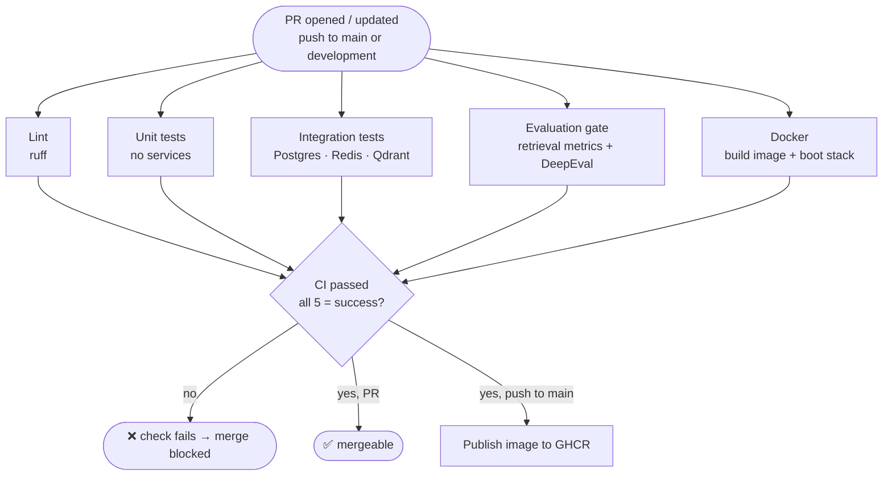

# Sprint 4 — S4.5 CI/CD Pipeline on GitHub

**Author:** Bassant Hossam , **Branch:** `CI/CD-pipeline-V2`

## Summary
Every pull request runs the full automated test suite against real PostgreSQL, Redis and Qdrant containers, scores retrieval quality, and builds and boots the project Docker image. One final job, **`CI passed`**, succeeds only if all of them succeed, and branch protection requires it, so a red run cannot be merged.

| Deliverable | Where |
|---|---|
| Workflow definition | [`.github/workflows/ci.yml`](../.github/workflows/ci.yml) |
| Repository with the active workflow | https://github.com/MoHatemTC/barq-sprints-agentic-incident-resolution-platform-g2/actions/workflows/ci.yml |
| Green run | [run 36769498275](https://github.com/MoHatemTC/barq-sprints-agentic-incident-resolution-platform-g2/actions/runs/36769498275) on PR [#36](https://github.com/MoHatemTC/barq-sprints-agentic-incident-resolution-platform-g2/pull/36) |
| Red run (merge blocked) | __RED_RUN__ |
| Deep reference (caching, eval gate, local runs) | [`docs/CI_CD.md`](CI_CD.md) |

---

## 1. Workflow Triggers and Structure

**Triggers** ([ci.yml:5-9](../.github/workflows/ci.yml#L5-L9))

| Event | Branches |
|---|---|
| `pull_request` | every PR, any target branch |
| `push` | `main`, `development` |
| `workflow_dispatch` | manual re-run from the Actions tab |

**Concurrency:** a newer push to the same PR cancels the older run. Pushes to `main` / `development` are never cancelled, so every merge gets a complete run (and `main` gets its image published).

**Jobs:** all five checks start in parallel. `CI passed` waits for them, and `publish` runs only on `main`.

| Job | What it proves | Timeout |
|---|---|---|
| Lint (ruff) | no syntax errors / undefined names | 5 min |
| Unit tests | all tests that need no services, run in parallel (`pytest -n auto`) | 10 min |
| Integration tests | tests on real Postgres, Redis and Qdrant, after `alembic upgrade head` | 10 min |
| Evaluation gate | retrieval quality is not below the floors in `eval/thresholds.json`; DeepEval suite when present | 10 min |
| Docker image + Compose smoke test | the image builds and the API answers `/health` and `/ready` | 10 min |
| **CI passed** | every job above ended in `success` | 2 min |
| Publish image to GHCR | *push to `main` only*, after `CI passed` inputs are green | 10 min |

**Companion workflows** (not required on every PR, so they don't slow it down):

| Workflow | When | Why separate |
|---|---|---|
| [`extractors.yml`](../.github/workflows/extractors.yml) | PDF-extractor code/data changes, push to `main` | ~3 min of PDF parsing |
| [`live-servicenow.yml`](../.github/workflows/live-servicenow.yml) | ServiceNow code changes, push to `main`, nightly | writes to the real ServiceNow instance |

---

## 2. Test Suite Runs in CI With Real Services

The integration job starts real service containers next to the runner:

| Service | Image | Readiness check before tests |
|---|---|---|
| PostgreSQL | `postgres:16` | `pg_isready` health check |
| Redis | `redis:7-alpine` | `redis-cli ping` health check |
| Qdrant | `qdrant/qdrant:v1.12.4` | "Wait for Qdrant" step polls `/readyz` (the image has no tools for a health check) |

Then it runs, in order:
1. `alembic upgrade head`: builds the real schema (tables, triggers) in the fresh database.
2. `pytest -m integration`: every test module listed in `_INTEGRATION_MODULES` in [`tests/conftest.py`](../tests/conftest.py) (database, idempotency, approvals, webhook, workflow, hybrid search…).

The unit job runs everything else (`pytest -m "not integration" -n auto`). Together the two jobs cover the whole `tests/` suite. The only exceptions:
- the slow PDF-extractor tests, which run in `extractors.yml`
- the live-ServiceNow tests, which skip themselves without `INCIDENT_SYS_ID` and run in `live-servicenow.yml`

Both jobs upload a JUnit report (`unit-test-report`, `integration-test-report`) as a run artifact.

**Regression evaluation.** The Evaluation gate ingests the committed KB snapshot (`data/kb_dataset.json`) into a fresh Qdrant. It then scores dense / hybrid / hybrid_rerank retrieval with `eval/ablation.py`, and `eval/gate.py` fails the job if any metric falls more than 0.02 below its floor.

**DeepEval.** The step runs the Sprint 4 DeepEval regression suite as soon as `eval/deepeval_regression.py` exists in the repository, and fails the job on a non-zero exit. The suite has not landed yet, so today the step logs a notice and passes.

**Configuration and secrets.** Nothing secret is committed.
- Non-secret settings (hosts, ports, queue names, retrieval parameters) live in the workflow `env:`.
- Real values come from GitHub repository secrets and are masked in logs.
- `.env` is git-ignored and never uploaded.

| Secret | Used by |
|---|---|
| `CI_POSTGRES_USER`, `CI_POSTGRES_PASSWORD` | Postgres service container + `DATABASE_URL` / `PG_CONN_STRING` |
| `LITELLM_BASE_URL`, `LITELLM_API_KEY`, `LITELLM_EMBEDDING_MODEL` | integration tests, evaluation gate |
| `SERVICENOW_*` (5), `INCIDENT_SYS_ID`, `INCIDENT_NUMBER` | `live-servicenow.yml` only |

ServiceNow values in `ci.yml` are `*.invalid` placeholders; every ServiceNow call in those tests is mocked.

---

## 3. Docker Build Runs in CI

The `docker` job:
1. Builds the project [`Dockerfile`](../Dockerfile) with Buildx. Layers are cached in the GitHub Actions cache, so unchanged dependency layers are not rebuilt.
2. Starts `postgres`, `redis`, `qdrant` and `api` with `docker compose up --wait`, using the image it just built (`--no-build`).
3. Polls `GET /health` and `GET /ready` for up to 60 s. If they never answer, it prints the API logs and fails.
4. Always tears the stack down (`docker compose down -v`).

So a broken Dockerfile, a missing dependency or an API that crashes on startup all fail CI. On a push to `main`, the `publish` job rebuilds from cache and pushes `ghcr.io/<owner>/<repo>:sha-<commit>` and `:latest`.

> The smoke test uses the local-dev `docker-compose.yml`, whose Postgres defaults (`app`/`app`) are throwaway values for a container that exists only for that job.

---

## 4. Pipeline Blocks on Failure (Evidence)

**Fail-closed by construction**
- No step uses `continue-on-error` or `|| true`. Any non-zero exit fails its job.
- Every job has a `timeout-minutes`, so a hang becomes a failure, not a stuck check.
- Missing secrets fail loudly (the eval gate checks `LITELLM_API_KEY` first) instead of silently skipping tests.
- `CI passed` runs with `if: always()` and fails when any required job ended in `failure`, `cancelled` or `skipped`. A skipped job can therefore never pass as green.

**Branch protection**
- `main` and `development` require the status check **`CI passed`** before merging, and require PRs to be up to date.
- Because only this one gate check is required, adding a job to the pipeline only means adding it to the gate's `needs:`.

**Green run: all checks pass, PR mergeable**

[Run 36769498275](https://github.com/MoHatemTC/barq-sprints-agentic-incident-resolution-platform-g2/actions/runs/36769498275) on PR [#36](https://github.com/MoHatemTC/barq-sprints-agentic-incident-resolution-platform-g2/pull/36) (`CI/CD-pipeline-V2 → development`), 2026-09-30:

| Job | Result |
|---|---|
| Lint (ruff) | ✅ success |
| Unit tests | ✅ success |
| Integration tests (Postgres + Redis + Qdrant) | ✅ success |
| Evaluation gate (DeepEval step: *"not present yet; skipped"* notice) | ✅ success |
| Docker image + Compose smoke test | ✅ success |
| **CI passed** | ✅ success |
| Publish image to GHCR | skipped (PR, not a push to `main`) |

The companion workflows on the same PR also passed: [Live ServiceNow tests](https://github.com/MoHatemTC/barq-sprints-agentic-incident-resolution-platform-g2/actions/runs/36769498324) and [PDF extractor tests](https://github.com/MoHatemTC/barq-sprints-agentic-incident-resolution-platform-g2/actions/runs/36769498243). The PR's merge state was `CLEAN` (mergeable).

**Red run: one failing test, merge blocked**

__RED_EVIDENCE__

---

## 5. Runtime Profile

Measured on GitHub-hosted `ubuntu-latest` runners from the job start/end times of the green run above ([36769498275](https://github.com/MoHatemTC/barq-sprints-agentic-incident-resolution-platform-g2/actions/runs/36769498275), warm caches):

| Job | Duration | Timeout |
|---|---|---|
| Lint (ruff) | 5 s | 5 min |
| Unit tests | 30 s | 10 min |
| Evaluation gate | 51 s | 10 min |
| Docker image + Compose smoke test | 1 m 01 s | 10 min |
| Integration tests | **2 m 19 s** (slowest) | 10 min |
| CI passed | 2 s | 2 min |
| **Whole run (wall clock)** | **2 m 27 s** | |

- **Parallel jobs:** the five checks run at the same time, so the wall-clock time is the integration job plus the gate (~2.5 min), not the sum (~4.8 min).
- **Cold caches:** the first run on a new dependency set (empty `.venv`, fastembed model, embedding and Docker-layer caches) took **~6 min** ([run 36481367893](https://github.com/MoHatemTC/barq-sprints-agentic-incident-resolution-platform-g2/actions/runs/36481367893)). The caches are keyed on `requirements.txt`, the KB snapshot and the eval set, so later runs are warm.
- **Upper bound:** every job has a timeout, so the worst case is a failed check after 10 min, never a hung PR.
- **Companion workflows** run beside `ci.yml` and are not required checks. On PR #36: Live ServiceNow 45 s, PDF extractors about 30 s per file (3 in parallel).

A PR gets its verdict in about 2.5 minutes, well inside an acceptable window for a merge gate.

---

## Files changed in S4.5

| File | Change |
|---|---|
| `.github/workflows/ci.yml` | `CI passed` gate job; Qdrant readiness wait; PR-only cancellation; Postgres credentials from secrets; DeepEval step |
| `.github/workflows/live-servicenow.yml` | Postgres credentials from secrets |
| `.github/workflows/extractors.yml` | placeholder DB URL without credentials |
| `docs/sprint4_cicd_pipeline.md` | this document |
